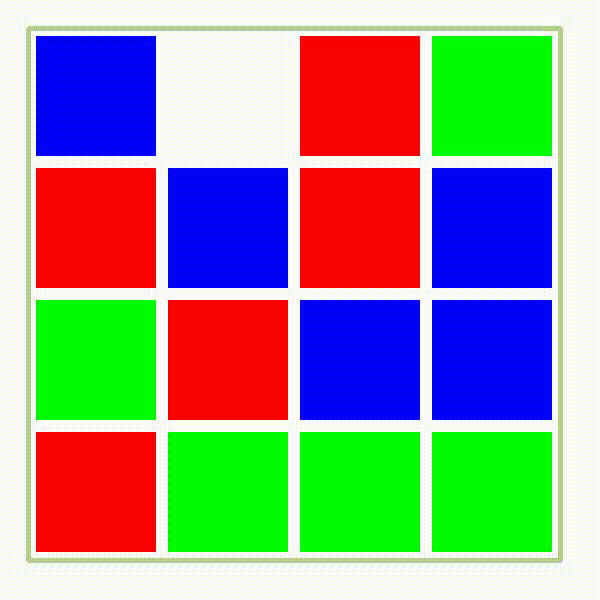

# Not-A-Puzzle
Not A Puzzle is an algorithm of objected squares. By clicking on each square it would move if there is an empty place nearby.  
  
Colors and the empty sopt are chosen randomly.  
It is made efficient with high performance using opencv and python 2.7.
